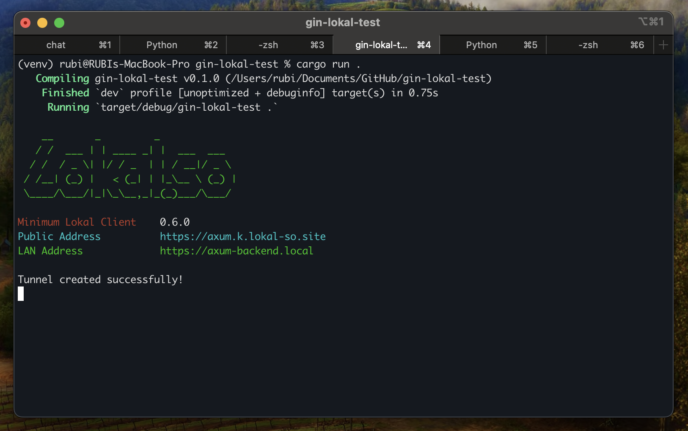
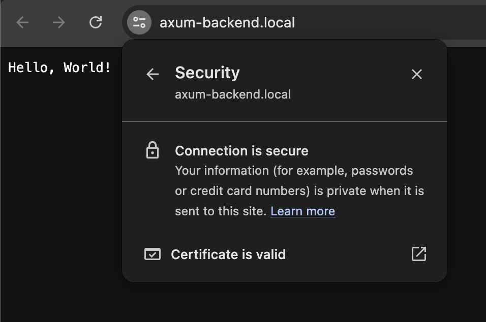

# Lokal Rust

Rust crates for interacting with Lokal Client REST API




```rust
use lokal_rs::lokal::Lokal;
use lokal_rs::tunnel::{Tunnel, TunnelType};

use axum::{routing::get, Router};
use tokio;

#[tokio::main]
async fn main() {
    let address = "0.0.0.0:3000";

    let lokal = Lokal::new_default();

    let mut tunnel = Tunnel::new(lokal)
        .set_local_address(address.to_string())
        .set_tunnel_type(TunnelType::HTTP)
        .set_inspection(true)
        .set_lan_address("axum-backend.local".to_string())
        .set_public_address("axum.k.lokal-so.site".to_string())
        .set_name("Axum Backend".to_string())
        .ignore_duplicate()
        .show_startup_banner();

    match tunnel.create().await {
        Ok(_) => println!("Tunnel created successfully!"),
        Err(e) => println!("Error creating tunnel: {}", e),
    }

    let app = Router::new()
        .route("/", get(root));

    let listener = tokio::net::TcpListener::bind(address).await.unwrap();
    axum::serve(listener, app).await.unwrap();
}

// basic handler that responds with a static string
async fn root() -> &'static str {
    "Hello, World!"
}
```
